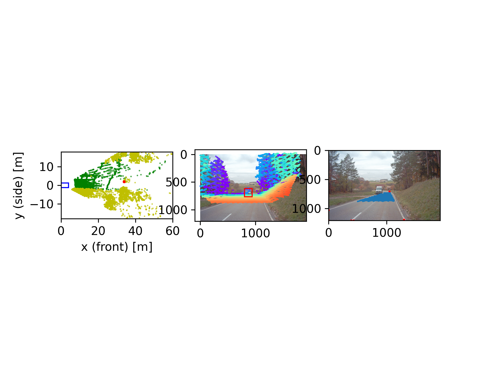
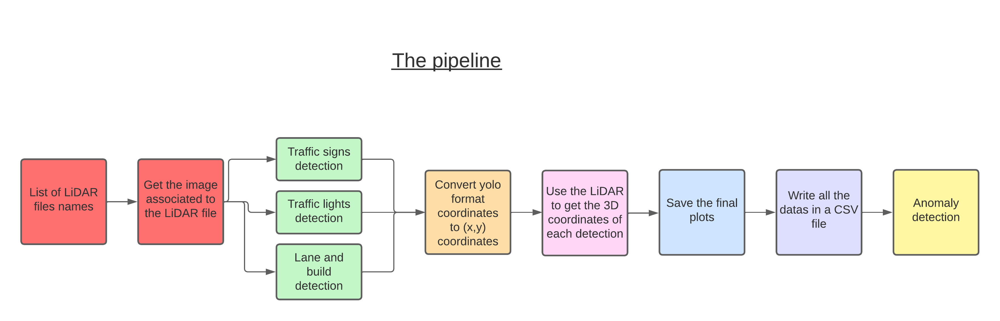

# AI-PROJECT-SMART_RECORDING_PIPELINE


|       Name               |              Major -  Semester           |     Exchange student yes/no  |     Assigned Tasks/Roles  |
|--------------------------|:----------------------------------------:|:----------------------------:|:-------------------------:|
|     Roxana Buder         |   AI 6                                   |   no                         |                           |
|     Lamard Arthur        |   ICS                                    |   yes                        |                           |
|     Sanamjeet Meyer      |   AI 6                                   |   no                         |                           |
|     Serife-Nur  Özdemir  |   AI 6                                   |   no                         |                           |
|     Shpineva Polina      |   ICS                                    |   yes                        |                           |
|     Kostennikov Danil    |   ICS                                    |   yes                        |                           |
|     Saed Abed            |   AI-6                                   |   no                         |                           |
|     Javier Górriz        |   ICS                                    |   yes                        |                           |
|     Roberto Rivas        |   ICS                                    |   yes                        |                           |
|     Alexander Shunyaev   |   ICS                                    |   yes                        |                           |


## How to use the code ? 

If you're facing path issue while running like "the module 'local_test' does not exist" type this command in your terminal to add the project to your python paht :
```
export PYTHONPATH="${PYTHONPATH}:<PATH_TO_YOUR_PROJECT>"
```

Your project's data has to have the same tree as the a2d2 dataset tree (example):
Inside each cam_front_semantic_bboxes files you'll find specific files from the a2d2 dataset (.npz for lidar, .json/.png from camera)
```
📦camera_lidar_semantic_bboxes
 ┃ ┣ 📂20181107_132300
 ┃ ┃ ┣ 📂camera
 ┃ ┃ ┃ ┗ 📂cam_front_center
 ┃ ┃ ┣ 📂label
 ┃ ┃ ┃ ┗ 📂cam_front_center
 ┃ ┃ ┣ 📂label3D
 ┃ ┃ ┃ ┗ 📂cam_front_center
 ┃ ┃ ┣ 📂lidar
 ┃ ┃ ┃ ┗ 📂cam_front_center
 ┣ 📜cams_lidar.json
 ┗ 📜class_list.json
```
## To run the code  :
### WARNING : Do not forget to change the paths in the 3d_detection file
version of python : 3.10.11

To create an environnement with conda please use the command : 
```
conda create --name <env> --file requirement_CONDA.txt python=3.10.11
```
To create an environnement with pip please use the command : 
```
pip install -r requirements_pip.txt
```
Then to run the code, go to the root folder of your project and run the command : 
```
python 3d_projection/3d_projection.py
```

## The pipeline :


## Author of the README.md file 
[Arthur Lamard](https://github.com/Micropot)


